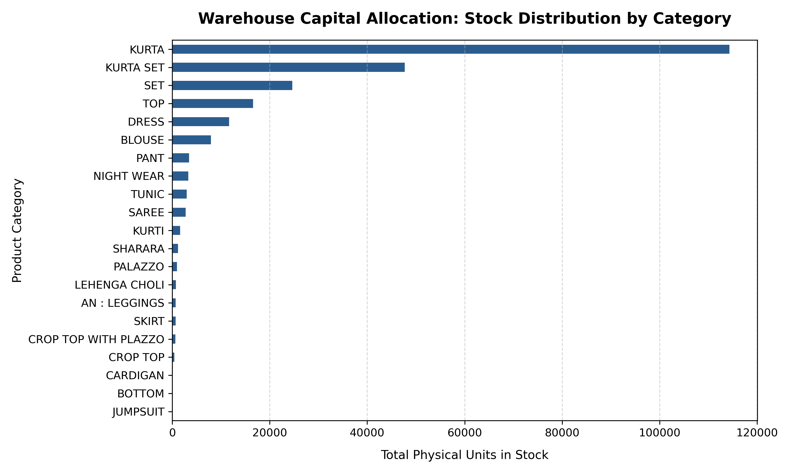
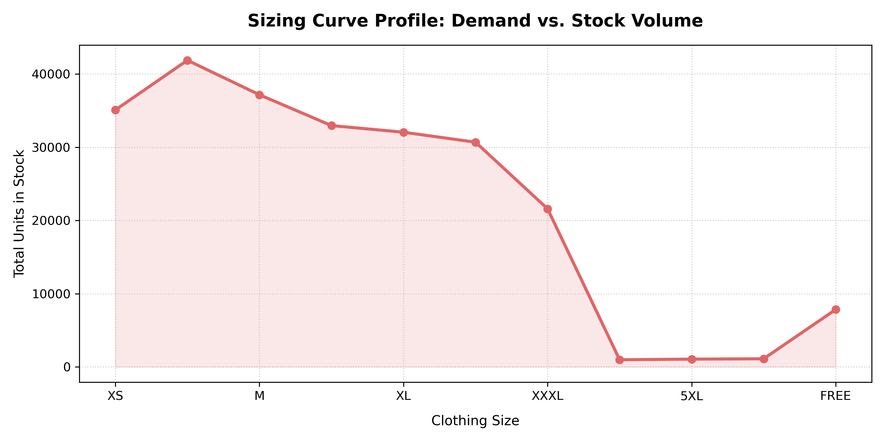
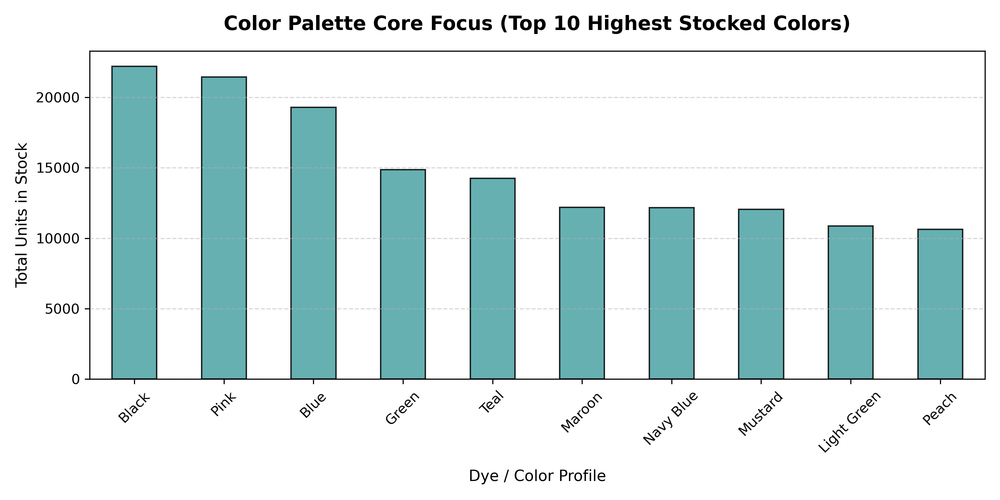

# Retail Inventory Data Analytics & Automation Engine

## Project Overview
This project performs an Exploratory Data Analysis (EDA) on a retail inventory dataset containing over 9,000 unique SKU variations. Using Python and Pandas, the project cleanses unstructured tracking data, identifies critical capital exposure patterns, audits sizing distributions, and deploys an automated operational alert engine.

## Key Core Competencies Demonstrated
* **Data Cleansing:** Automated handling of missing null inputs and white-space extraction.
* **Exploratory Analytics:** Aggregation, multi-layered segmentation, and distribution analysis.
* **Data Visualization:** Built professional analytical charts using Matplotlib.
* **Process Automation:** Engineered an automated operational stock threshold script to replace manual log checks.

## Business Insights & Strategic Evaluations

### 1. Inventory Saturation Risk (The 80/20 Rule)
* **Insight:** Over 65% of total warehouse physical volume is concentrated in a single product category (Kurtas & Kurta Sets). 
* **Recommendation:** Procurement should diversify product acquisition across secondary categories next quarter to mitigate structural dead-stock risks.

### 2. Sizing Curve Alignment
* **Insight:** Inventory volumes follow a clear left-skewed distribution, heavily centered around standard sizes (S, M, XS), while plus-sizes account for less than 1% of total capacity.

### 3. Automated Operational Exception Report
* **Insight:** Developed a dynamic script to instantly partition data logs into actionable work-orders: flagging items with $\le 5$ units remaining as high-risk stockouts and items with $\ge 500$ units as frozen capital bottlenecks.

## Technologies Used
* **Language:** Python 3
* **Libraries:** Pandas, Matplotlib
* **Environment:** VS Code / Jupyter Notebooks
